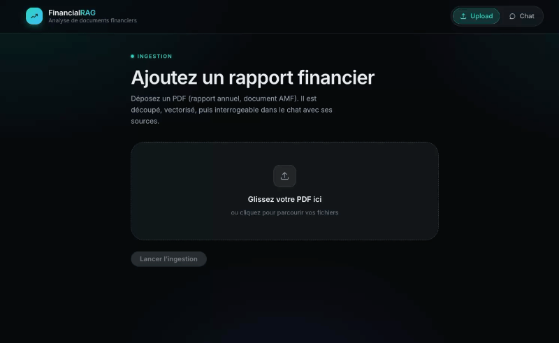
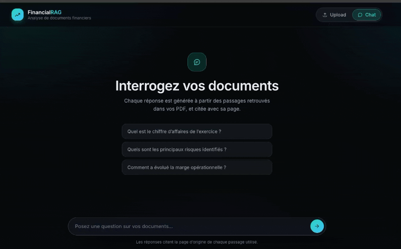
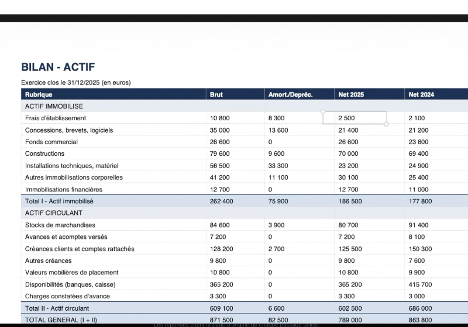

# financial-doc-analyzer

[🇫🇷 Lire en français](README.fr.md)

A full-stack **RAG** (Retrieval-Augmented Generation) system for analyzing French financial
documents (annual reports / regulatory filings)

**Hybrid AI architecture**: local embeddings (Ollama `bge-m3`) + generation via **AI**,
abstracted behind a provider interface so swapping to a fully offline LLM is a one-line change.
Vector storage in **PostgreSQL + pgvector**. Backend **FastAPI** (Python 3.12, async), frontend
**Angular 21** (standalone components, signals, `httpResource`).

## Stack

| Layer | Choice | Why |
|---|---|---|
| Backend | Python 3.12 + FastAPI + Uvicorn | Async, Pydantic validation, auto OpenAPI docs |
| Embeddings | Ollama `bge-m3` (multilingual, dim. 1024) | Local, free, no data leaves the machine |
| Generation | Mistral AI (`mistral-small-latest`, SDK `mistralai`) | Free-tier cloud LLM, strong French support |
| Vector store | PostgreSQL 16 + pgvector (HNSW index) | SQL + vector search in one database |
| Lexical search | PostgreSQL full-text (`tsvector`, GIN index) | Fused with vector search via RRF (Phase 9) |
| ORM | SQLAlchemy 2 (async) + `asyncpg` | Modern async ORM, native vector types |
| PDF parsing | `pdfplumber` | Handles financial tables, not just prose |
| Frontend | Angular 21 — standalone, signals, `httpResource` | Modern reactive Angular, no NgModules |
| Containers | Docker Compose (override pattern: local/debug/test/prod) | Reproducible across environments |
| Quality | Ruff (Python) · Prettier/ESLint (TypeScript) | Enforced in CI on every PR |
| Tests | Pytest (backend) · Vitest + Playwright (frontend) | Unit + integration + E2E |

## Architecture

```
Ingestion (once per document)              Query (on every question)
─────────────────────────────              ──────────────────────────
PDF                                         question
 │  pdfplumber (text + tables)                │  embed (Ollama bge-m3)
 ▼                                            ▼
chunker (boundary-anchored, overlap)        ┌─────────────┬──────────────┐
 │                                          vector search   lexical search
 ▼                                          (pgvector,      (Postgres FTS,
embedder (Ollama bge-m3, dim 1024)          cosine)         ts_rank_cd)
 │                                            └──────┬───────┘
 ▼                                                   ▼
PostgreSQL + pgvector                        Reciprocal Rank Fusion
 (chunks table: embedding + tsvector)                 │
                                                        ▼
                                            grounded prompt → Mistral AI
                                                        │
                                                        ▼
                                         streamed answer (SSE) + cited sources
```

## What's implemented, phase by phase

| Phase | Delivers | Core module |
|---|---|---|
| 0 — Foundations | Multi-env Docker Compose (local/debug/test/prod) + Makefile, Ruff/Pytest config | `docker-compose*.yml`, `Makefile` |
| 1 — Ingestion | PDF → cleaned text + tables + metadata (company, year) | `app/ingestion/loader.py` |
| 2 — Chunking | Boundary-anchored chunking with overlap; one chunk per table | `app/ingestion/chunker.py` |
| 3 — Embeddings & indexing | Ollama embeddings, pgvector schema + HNSW index | `app/ingestion/embedder.py`, `app/models.py` |
| 4 — Retrieval | Top-k vector similarity search, metadata filters | `app/retrieval/search.py` |
| 5 — Generation | Provider-agnostic LLM interface, grounded/anti-hallucination prompting | `app/rag/llm.py`, `app/rag/pipeline.py` |
| 6 — API | `/health`, `/ingest`, `/query` (SSE streaming) | `app/api/routes.py` |
| 7 — Frontend | Angular chat + upload UI, streamed answers with citations | `frontend/src/app/features/` |
| 8 — Tests & evaluation | Playwright E2E; custom retrieval eval (recall@k, MRR) | `frontend/e2e/`, `eval/evaluate.py` |
| 9 — Hybrid retrieval | Vector + full-text search fused via Reciprocal Rank Fusion | `app/retrieval/search.py` (`hybrid_search`) |

## Vidéos de démonstration

<p align="center">
  
</p>

<p><strong>▶ Démo 01 — Pipeline d’ingestion</strong></p>

Cette courte vidéo montre comment les PDF financiers bruts sont extraits, nettoyés et transformés en chunks structurés prêts à être indexés.

<p align="center">
  
</p>

<p><strong>▶ Démo 02 — Recherche</strong></p>

Cette démonstration met en avant la couche de recherche : matching sémantique et recherche hybride sur le corpus indexé.

<p align="center">
  
</p>

<p><strong>▶ Démo 03 — Vérification & évaluation</strong></p>

Cette vidéo illustre le flux de validation et les métriques de recherche utilisées pour vérifier que le système répond avec des sources pertinentes et ancrées.

<p align="center">
  
</p>

## Retrieval evaluation — measure before optimizing

`make eval` replays 15 ground-truth questions against the retrieval layer and reports **recall@k**
and **MRR** — quantifying retrieval quality *before* generation even runs. Phase 8 established a
baseline with vector search only; the result motivated Phase 9's hybrid search:

| Metric | Vector search only (Phase 8) | Hybrid: vector + full-text, RRF (Phase 9) |
|---|---|---|
| recall@5 | 0.933 (14/15) | **1.000 (15/15)** |
| MRR | 0.889 | **0.967** |

**Why the gain**: dense embeddings are weak at exact lexical lookups — a company registry code or
an identifier doesn't "resemble" anything semantically, so the closest embeddings can be
completely unrelated. Fusing a lightweight PostgreSQL full-text signal (no new infrastructure —
same `pgvector/pgvector` image) via Reciprocal Rank Fusion recovers those cases without hurting
the semantic matches that already worked.

## Testing

- **Backend**: 59 Pytest tests (unit + integration against a real ephemeral Postgres/pgvector),
  `make test`.
- **Frontend**: Vitest unit tests (components, services) + 6 Playwright E2E scenarios
  (upload → question → streamed answer, API mocked at the network layer), `npm test` / `npm run e2e`.
- **CI**: GitHub Actions runs Ruff (lint + format) and the full Pytest suite on every PR.

## Getting started

```bash
make setup          # scaffolds .env.local / .env.prod from .env.example
make pull-models     # pulls the Ollama bge-m3 embedding model
make local           # starts PostgreSQL + the FastAPI backend (http://localhost:8000)
make test            # full Pytest suite, disposable database
make eval            # retrieval evaluation (recall@k, MRR) — requires ingested documents
```

Frontend (run separately, not containerized):

```bash
cd frontend
npm install
npm start            # http://localhost:4200
```

Ingest a document from the CLI:

```bash
docker compose --env-file .env.local run --rm backend python scripts/ingest_cli.py data/raw/your-file.pdf
```

> PDFs under `data/raw/` are git-ignored.

All commands are wrapped by the **Makefile** — `make help` lists every target.
